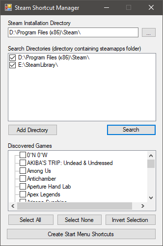

# Steam Shortcut Manager

Adds Steam game shortcuts to the Start Menu, even after they've been installed.

## Features
- Auto-detects Steam installation
- Auto-detects active Steam library locations
- Automatically grabs game icons from Steam's icon cache
